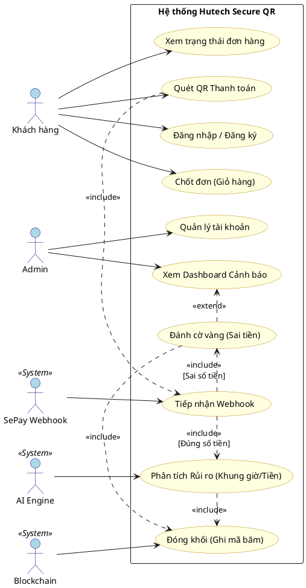

# SƠ ĐỒ USE CASE CHI TIẾT: HỆ THỐNG THANH TOÁN QR SECURE

Dựa trên cấu trúc sơ đồ tham chiếu, dưới đây là Sơ đồ Use Case được thiết kế riêng cho đồ án của bạn. Sơ đồ tập trung trả lời 2 câu hỏi cốt lõi: **Ai (Actors)** và **Làm gì (Use Cases)**, kết hợp cùng luồng rẽ nhánh (Include/Extend) của AI và Blockchain.

## 1. Sơ đồ Use Case (Mermaid)

Bạn có thể copy đoạn code dưới đây và dán vào [Mermaid Live Editor](https://mermaid.live/) hoặc sử dụng trong Markdown hỗ trợ Mermaid để hiển thị sơ đồ.

```mermaid
flowchart LR
    %% Định nghĩa Actors (Bên trái: Con người | Bên phải: Hệ thống máy móc)
    User(("\n🧍 Khách hàng\n(User)\n"))
    Admin(("\n👨‍💼 Quản trị viên\n(Admin)\n"))
    
    SePay(("\n🏦 Đối tác SePay\n(Webhook API)\n"))
    AIEngine(("\n🧠 Hệ thống AI\n(Isolation Forest)\n"))
    Blockchain(("\n🔗 Mạng Blockchain\n(Sổ cái bất biến)\n"))

    %% Box Hệ thống chính
    subgraph System [HỆ THỐNG PHÁT HIỆN GIAO DỊCH BẤT THƯỜNG (AI & BLOCKCHAIN)]
        direction TB
        
        %% Use Cases cơ bản
        UC_Register([Đăng ký/Đăng nhập])
        UC_Cart([Thêm vào Giỏ hàng & Chốt đơn])
        UC_History([Xem trạng thái đơn hàng])
        
        UC_ManageUsers([Quản lý tài khoản])
        UC_Dashboard([Xem Dashboard & Cảnh báo đỏ])
        
        %% Box Core Transaction (Rule-based & AI-driven)
        subgraph Core [HỆ THỐNG KIỂM DUYỆT GIAO DỊCH PHÂN NHÁNH]
            direction TB
            UC_Pay([Quét QR Thanh toán])
            
            UC_Webhook([Tiếp nhận biến động số dư])
            
            Cond_Amount{Khớp 100% \nsố tiền?}
            
            UC_AmountMismatch([Đánh cờ vàng \n(Sai tiền)])
            UC_AIAnalyze([Phân tích rủi ro AI \n(Khung giờ & Số tiền)])
            
            UC_Block([Thực thi trên Blockchain \n(Ghi mã băm, Duyệt/Chặn)])
        end
    end

    %% Tương tác của Khách hàng
    User --> UC_Register
    User --> UC_Cart
    User --> UC_Pay
    User --> UC_History

    %% Tương tác của Admin
    Admin --> UC_ManageUsers
    Admin --> UC_Dashboard
    Admin --> UC_Block

    %% Luồng rẽ nhánh bên trong hệ thống (Includes & Extends chuẩn UML)
    UC_Pay -.->|&laquo;include&raquo;| UC_Webhook
    UC_Webhook --> Cond_Amount
    
    Cond_Amount -->|Không khớp| UC_AmountMismatch
    Cond_Amount -->|Khớp| UC_AIAnalyze
    
    UC_AmountMismatch -.->|&laquo;include&raquo;| UC_Block
    UC_AIAnalyze -.->|&laquo;include&raquo;| UC_Block
    
    UC_AmountMismatch -.->|&laquo;extend&raquo;\n(Nếu bị đánh cờ)| UC_Dashboard

    %% Tương tác của Hệ thống bên thứ 3 (Right Actors)
    SePay --> UC_Webhook
    AIEngine --> UC_AIAnalyze
    Blockchain --> UC_Block

    %% Styling
    classDef actor fill:#f9f9f9,stroke:#333,stroke-width:2px;
    classDef usecase fill:#fff,stroke:#333,stroke-width:1px,rx:20px,ry:20px;
    classDef core fill:#ffeb3b,stroke:#f57f17,stroke-width:2px;
    classDef danger fill:#ffcdd2,stroke:#d32f2f,stroke-width:2px;
    
    class User,Admin,SePay,AIEngine,Blockchain actor;
    class UC_Register,UC_Cart,UC_History,UC_ManageUsers,UC_Dashboard,UC_Webhook usecase;
    class UC_Pay,UC_AIAnalyze,UC_Block core;
    class UC_AmountMismatch danger;
```

## 2. Giải nghĩa chi tiết Sơ đồ Use Case

Sơ đồ trên được chia thành 2 nhóm chủ thể (Actors) và 1 vùng hệ thống trung tâm:

### Nhóm 1: Người dùng thao tác (Primary Actors - Bên trái)
1. **Khách hàng (User):**
   - Đăng ký / Đăng nhập.
   - Thêm vào giỏ hàng & Chốt đơn (Tạo ra hóa đơn chờ PENDING).
   - Quét QR Thanh toán.
   - Xem trạng thái đơn hàng (Nhận thông báo Ting Ting khi thành công).
2. **Quản trị viên (Admin):**
   - Quản lý tài khoản hệ thống.
   - Xem Dashboard & Cảnh báo đỏ (Nhận diện các đơn hàng bị FLAGGED do sai tiền hoặc do AI nghi ngờ).

### Nhóm 2: Hệ thống và Đối tác (Secondary Actors - Bên phải)
1. **Đối tác SePay (Webhook API):** Đóng vai trò là hệ thống "đánh thức" (Trigger). Khi khách hàng chuyển khoản xong, SePay tự động gọi API Webhook để truyền dữ liệu tiền thật về hệ thống.
2. **Hệ thống AI (AI Engine):** Nhận dữ liệu từ Webhook, áp dụng thuật toán `Isolation Forest` để chấm điểm dị thường dựa trên "Số tiền" và "Khung giờ".
3. **Mạng Blockchain (Smart Contract / Ledger):** Nhận phán quyết cuối cùng (Duyệt hoặc Chặn) để tiến hành băm dữ liệu (SHA-256) và đóng khối vĩnh viễn không thể xóa sửa.

### Luồng phân nhánh kiểm duyệt (Core Transaction)
Đây là trái tim của hệ thống đồ án, kết hợp giữa Quy tắc cứng (Rule-based) và Trí tuệ nhân tạo (AI-driven):
- Khi SePay đẩy dữ liệu về (`Tiếp nhận biến động số dư`), hệ thống sẽ kiểm tra quy tắc cứng: **Có khớp 100% số tiền không?**
- Nếu **Không khớp**: Lập tức chuyển hướng sang `Đánh cờ vàng (Sai tiền)`.
- Nếu **Khớp**: Chuyển dữ liệu qua cho `Hệ thống AI phân tích rủi ro`.
- Dù kết quả là Giao dịch Xanh (PAID) hay Giao dịch Đỏ (FLAGGED), mọi dữ liệu đều `include` (bắt buộc bao gồm) hành động `Thực thi trên Blockchain` để khóa sổ cái.

---

## 3. Mã Code PlantUML (Dành cho trang PlantText.com)

Nếu bạn cần một sơ đồ tuân thủ **chuẩn học thuật 100% của UML**, hãy copy đoạn code dưới đây và dán vào trang web **[PlantText.com](https://www.planttext.com/)**:


